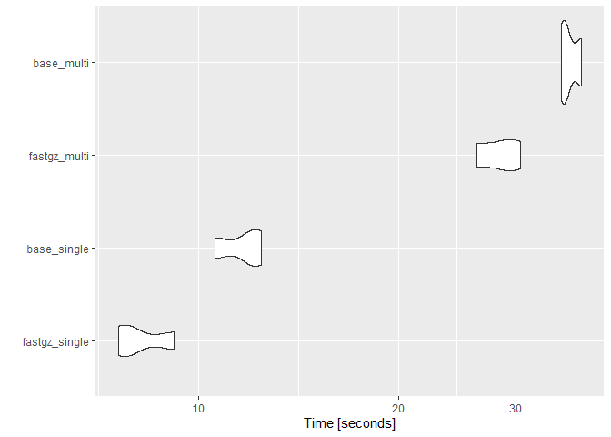

<!-- README.Rmd generates README.md. -->

# `{fastgz}`

<!-- badges: start -->

[](https://cran.r-project.org/package=fastgz)
[](https://www.tidyverse.org/lifecycle/#experimental)
[](https://github.com/knapply/fastgz/commits/master)
[](https://codecov.io/gh/knapply/fastgz?branch=master)
[](https://ci.appveyor.com/project/knapply/fastgz)
[](https://travis-ci.org/knapply/fastgz)
[](https://www.gnu.org/licenses/gpl-3.0)
[](https://github.com/knapply/fastgz)
[](http://hits.dwyl.io/knapply/fastgz)
<!-- badges: end -->

# Why?

Files of non-trivial sizes are typically gzip files. `base::readLines()`
is suprisingly quick at reading them, but we can go a tad faster. On the
other hand, `readr::read_lines()` decompresses the file before reading
it, which is… less than ideal.

`{fastgz}` contains two simple helpers:

1.  `fastgz::read_gz_file()` reads an entire file(s) into a single
    `character()`
2.  `fastgz::read_gz_lines()`is the equivalent of
    `base::readLines()`/`readr::read_lines()`

Rather than relying the `apply()`/`purrr::map()` families, you can pass
multiple file paths to both.

# Benchmarks

``` r
library(fastgz)
library(microbenchmark)
library(ggplot2)

file_dir <- readRDS("big_file_path")

files <- dir(file_dir, pattern = "\\.gz$", full.names = TRUE)[1:3]

scales::number_bytes(sum(file.size(files)))
```

    #> [1] "531 MiB"

``` r
res <- microbenchmark(
  fastgz_single = fastgz_single <- read_gz_lines(files[[1]]),
  base_single   = base_single   <- readLines(files[[1]]),
  fastgz_multi  = fastgz_multi  <- read_gz_lines(files),
  base_multi    = base_multi    <- unlist(lapply(files, readLines), 
                                          use.names = FALSE)
  ,
  times = 3
)

identical(fastgz_single, base_single) && identical(fastgz_multi, base_multi)
```

    #> [1] TRUE

``` r
lapply(list(single = fastgz_single, multi = fastgz_multi), pryr::object_size)
```

    #> $single
    #> 1.64 GB
    #> 
    #> $multi
    #> 5.05 GB

``` r
res
```

    #> Unit: seconds
    #>           expr       min        lq      mean    median        uq      max neval
    #>  fastgz_single  7.578187  7.728361  8.210194  7.878535  8.526197  9.17386     3
    #>    base_single 10.570881 11.259491 11.639672 11.948101 12.174068 12.40003     3
    #>   fastgz_multi 26.185492 27.386044 28.428467 28.586596 29.549954 30.51331     3
    #>     base_multi 35.149941 35.464957 36.197976 35.779973 36.721994 37.66401     3

``` r
autoplot(res)
```



# Shout Outs

  - [`{Rcpp}`](http://www.rcpp.org/)
  - [`Gzstream`](https://www.cs.unc.edu/Research/compgeom/gzstream/)
